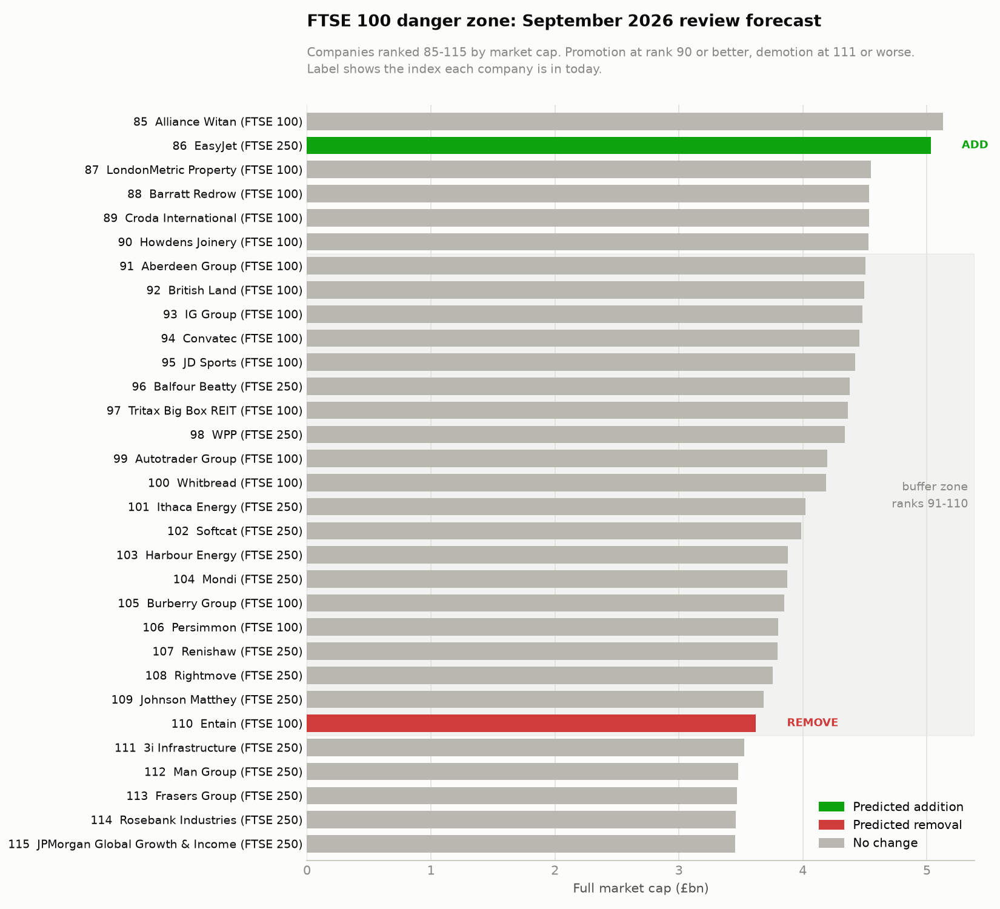

# FTSE 100 index rebalance forecast

Forecasts which companies will be added to and removed from the FTSE 100 at a
quarterly review, using the size-rank rule from FTSE Russell's Ground Rules.

Two things are produced:

1. **A leakage-free backtest of the June 2026 review** — membership rewound to
   how it stood before that review, companies sized on their 2 June closing
   prices. Scored **6 of 6** confirmed changes, with 2 false positives.
2. **A live forecast for the September 2026 review** — from today's membership
   and today's market caps. That review has not happened, so it has no scorecard.

---

## Why this is worth forecasting

Passive funds tracking the FTSE 100 do not get a choice. When FTSE Russell
announces that a company is joining the index, every tracker fund holding the
FTSE 100 has to buy it, and has to buy it by the effective date. When a company
is demoted, they have to sell. That demand is price-insensitive and it is
concentrated into a known window.

Anyone who can work out which companies are coming in and going out *before* the
announcement knows where a large, forced, one-directional flow is about to land.
That is why index rebalance forecasting is a product: firms sell exactly this
call to trading desks and event-driven funds. This repo is a simplified,
honest version of that idea — the size rule and nothing else.

---

## The rule

The FTSE 100 is the 100 largest London-listed companies by market cap. The
FTSE 250 is the next 250. Together they form the FTSE 350, which is the
candidate pool here.

At each quarterly review, ranked by market cap:

| Condition | Outcome |
|---|---|
| Rank 90 or better, and currently **outside** the FTSE 100 | Promoted in |
| Rank 111 or worse, and currently **inside** the FTSE 100 | Demoted out |
| Ranks 91–110 | Buffer — left unchanged |

The buffer exists to stop companies bouncing in and out on small price moves.

**One-for-one matching.** The index must hold exactly 100 companies, so every
promotion needs a matching demotion. The threshold rule rarely produces equal
numbers — the buffer means a company can qualify to come in while nobody has
fallen far enough to drop out. Whichever side is short is topped up from the
ranking edge: the lowest-ranked current members are demoted, or the
highest-ranked outsiders are promoted, until the two sides match.

This matters for reading the output. In the September forecast, **Entain is
demoted at rank 110 — inside the buffer.** It is not being demoted for falling
to 111. It is being demoted because EasyJet qualified to come in at rank 86, no
member had fallen to 111 or worse, and Entain is the lowest-ranked member, so it
is the one that makes room. The code prints threshold-driven and
balancing-driven changes separately so the two are never confused.

---

## Method

1. Scrape the current FTSE 100 and FTSE 250 constituent lists from Wikipedia with
   `pandas.read_html` and combine them into the FTSE 350 pool, tagged by index.
2. Pull market cap for every company from yfinance on its `.L` London ticker.
3. Normalise currency (see the pence trap below) and rank all 350, largest first.
4. Apply the threshold rule, then the one-for-one balancing step.
5. Write the CSV and the danger-zone chart.

### The pence trap

**yfinance quotes London stocks in pence, not pounds.** The currency code comes
back as `GBp`, and `fast_info.marketCap` is computed from that pence price — so
Shell arrives as 18.2 *trillion* rather than 182 billion, a factor of 100 out.

This is nastier than a normal data bug because it does not break anything
visibly. Some companies are affected and some are not, so the ranking still
looks like a plausible list of British companies while being wrong in the middle,
which is precisely where the promotion and demotion boundaries sit.

Handled in two places:

- **Market caps.** `Ticker.info["marketCap"]` is normally already converted to
  pounds, but that is undocumented behaviour that could change. Rather than trust
  it, the code checks the scale against price × shares and divides by 100 if the
  value is still on the pence scale. The trigger is a loose 10× because
  dual-listed companies (Rio Tinto, Investec) legitimately have more shares than
  `sharesOutstanding` reports — we are catching a factor-of-100 error, not
  auditing share counts. On the current run the guard fires 0 times, which is the
  expected result when yfinance behaves; it is there to fail loudly if that changes.
- **Historical prices in the backtest.** The same conversion runs on the 2 June
  closes, via the same `price_to_gbp` function.

Seven constituents are quoted in USD or EUR rather than pence (Compass Group,
IHG, Metlen, and four investment trusts). These are converted to GBP at the
exchange rate for the relevant date — the live rate for the forecast, the 2 June
rate for the backtest.

---

## Part 1 — Backtest of the June 2026 review

### The look-ahead problem, and how it is avoided

Today's Wikipedia constituent lists are the **"after" picture**. Aberdeen Group,
Computacenter and Investec sit in the FTSE 100 today *precisely because the June
review put them there*. Ranking against that membership and then asking the model
to predict June would be asking a question whose answer is already in the input.
The first version of this project did exactly that, and the result was worthless.

Two fixes, both required:

**Membership is rewound.** The three companies added in June are put back in the
FTSE 250, and the three removed are put back in the FTSE 100. Both sides are
flipped so the pool still splits 100 / 250.

**Prices are taken at the cutoff, not today.** FTSE measures size at close on the
Tuesday before the first Friday of the review month. The first Friday of June 2026
was the 5th, so the cutoff is **Tuesday 2 June 2026**. Every company is sized on
its 2 June closing price. Share counts are approximated — see limitations.

The rule then runs unchanged on that reconstructed state.

### Result

**6 of 6 confirmed changes correctly identified.**

| Confirmed June 2026 change | Model | Rank on 2 June |
|---|---|---|
| Add — Investec | HIT | 74 |
| Add — Computacenter | HIT | 83 |
| Add — Aberdeen Group | HIT | 87 |
| Remove — Mondi | HIT | 111 |
| Remove — Rightmove | HIT | 113 |
| Remove — Berkeley Group Holdings | HIT | 117 |

**It also predicted two changes that did not happen:** Harbour Energy (rank 88,
would have been promoted) and Persimmon (rank 108, demoted by the balancing step).

So the honest scoreline is 8 predicted changes against 6 real ones: perfect
recall, 6/8 precision. Recall being perfect while precision is not is the
expected shape for a size-only model — real size moves are captured, but the
eligibility screens and free-float adjustments that would have disqualified
Harbour Energy and spared Persimmon are not modelled. Nothing was tuned to
produce this; the two false positives are reported as they came out.

For contrast, an earlier version of this backtest rewound membership but reused
*today's* market caps rather than 2 June's. It scored 4 of 6. Using the correct
cutoff date is doing real work here, not cosmetic work.

---

## Part 2 — Live forecast: September 2026 review

Run on today's membership and today's market caps. **This review has not
happened, so there is no hit count for it yet.**

| Company | Currently | Rank | Predicted |
|---|---|---|---|
| EasyJet | FTSE 250 | 86 | **Add** — qualifies at rank 90 or better |
| Entain | FTSE 100 | 110 | **Remove** — one-for-one balancing, not the threshold |



The chart shows ranks 85–115, the band where review outcomes are actually
decided. Bar colour carries the prediction; the row label carries which index the
company is in today. Those are deliberately separate channels — rank alone does
not tell you which side of the boundary a company starts from, and several
companies in the buffer are FTSE 250 names ranking above FTSE 100 names.

Market caps move, so this forecast changes as prices do. It is a snapshot, not a
standing call.

---

## Limitations

These are the point of the project, not something to hide. A size-rank model is a
first approximation of a process that is more involved.

**(a) Share counts in the backtest are approximated.** yfinance does not serve
historical shares outstanding. The backtest divides today's market cap by today's
price to imply a share count, holds it constant, and multiplies by the 2 June
closing price. A company that has issued stock or bought back stock since June is
mis-sized by however much the count moved. For a boundary name, that is enough to
move it a rank or two.

**(b) Full market cap is a proxy for free-float-adjusted investable market cap.**
FTSE ranks on the value of shares *actually available to investors*, excluding
strategic stakes, government holdings, cross-holdings and restricted stock. This
model uses full market cap. A company with a large controlling shareholder is
therefore over-sized here relative to how FTSE sees it. This is the single largest
source of error, and it bites hardest exactly at the boundary, where the
ranking decisions are made.

**(c) Free data is not the official data.** Even with the correct cutoff date,
these are Yahoo-sourced closing prices, not the official exchange prices and
share registers FTSE works from. Small discrepancies in price, share count or
timing will not reproduce the official cutoff exactly.

**(d) Eligibility screens are not modelled.** FTSE applies nationality rules,
free-float minimums and liquidity screens before a company is eligible at all. A
pure size rank ignores all of them, so it will occasionally promote a company that
was never eligible. FTSE also changed its free-float requirement for non-UK
companies effective June 2026, which a size-only model does not capture.

**(e) Misses near the boundary are expected.** Given (a) through (d), a company
sitting within a rank or two of the 90 or 111 thresholds can be called wrongly by
this model for reasons that have nothing to do with the rule being wrong. Both
false positives in the June backtest sit in exactly that zone. These are reported
as they came out rather than tuned away — a boundary model that claimed to be
exact would be lying.

**One further caveat on the backtest.** Rewinding membership uses knowledge of
which six companies changed. The model does not use those labels to rank — it
ranks all 350 on 2 June prices and applies the thresholds, and it was free to
name entirely different companies, which it partly did. But the "before" state is
reconstructed from the outcome rather than read from an archived pre-review
constituent list. Pulling a May 2026 snapshot from Wikipedia's revision history
would remove that dependency, and is the obvious next improvement.

---

## Running it

```bash
pip install -r requirements.txt
```

```bash
python forecast.py
```

Takes a couple of minutes, most of it fetching 350 tickers. Prints the backtest
and the live forecast, and writes both outputs.

## Output

| File | What it is |
|---|---|
| `output/ftse100_rebalance_forecast.csv` | All 350 companies: ticker, name, current index, market cap, rank, predicted action |
| `output/danger_zone.png` | The chart above — ranks 85–115 |

Tickers that return no market cap are reported by name and marked `no data`
rather than dropped silently. On recent runs, 0 of 350 fail on live market caps;
the 2 June price fetch intermittently drops one ticker (Funding Circle), which is
named in the output and excluded from that ranking. Both counts are printed every
run rather than assumed.

## Scope

One index, one rule, one CSV, one chart. No free-float weighting, no other
indices, no scheduling. The FTSE 350 pool means a company outside the FTSE 350
that is large enough to be promoted would be missed, which is rare enough to
accept for a project this size.
